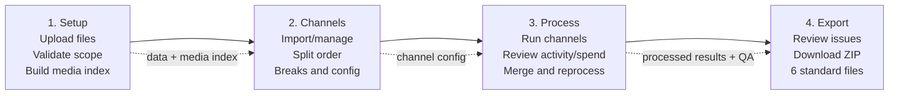
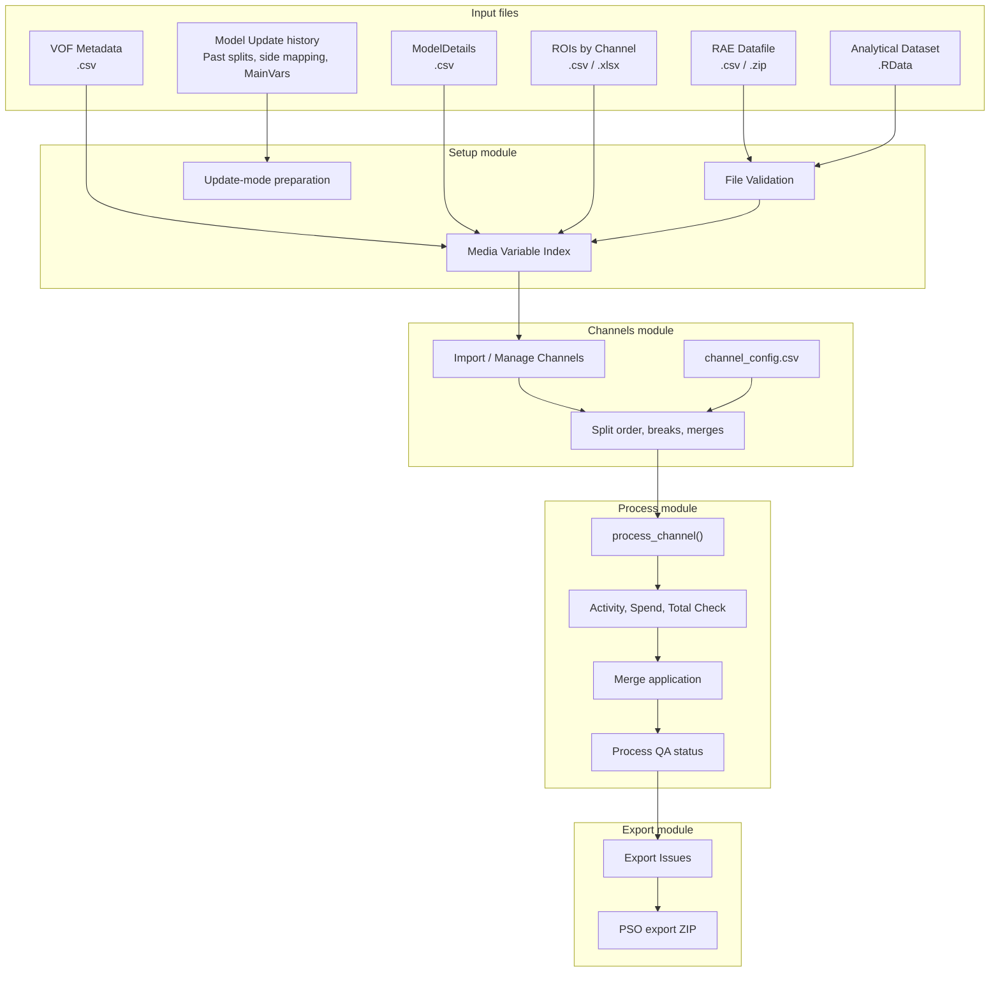
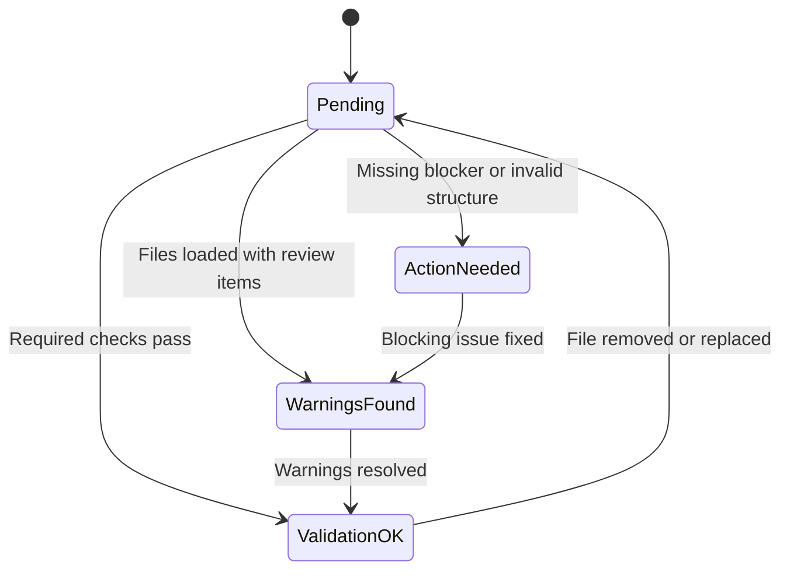
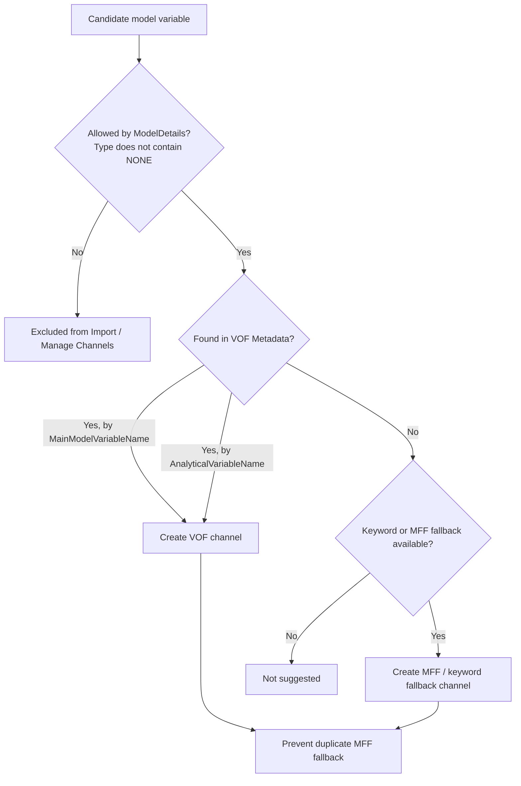
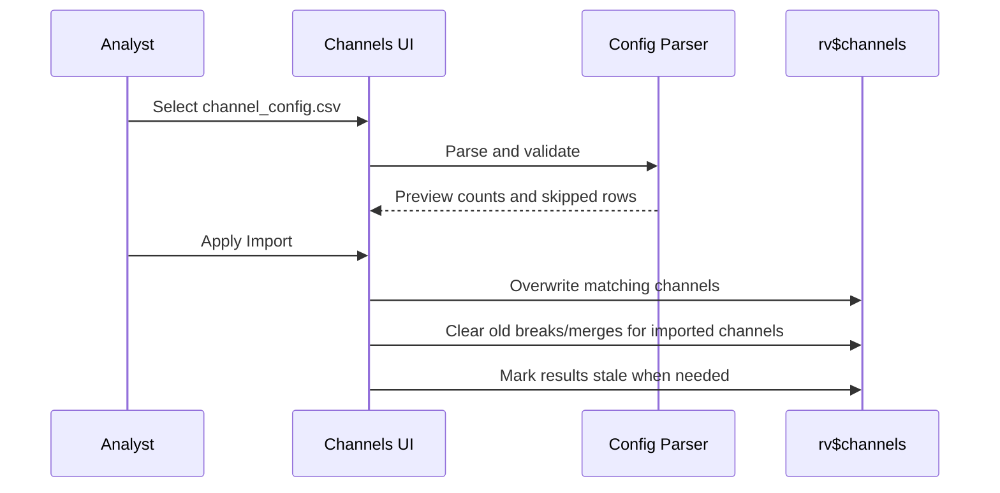
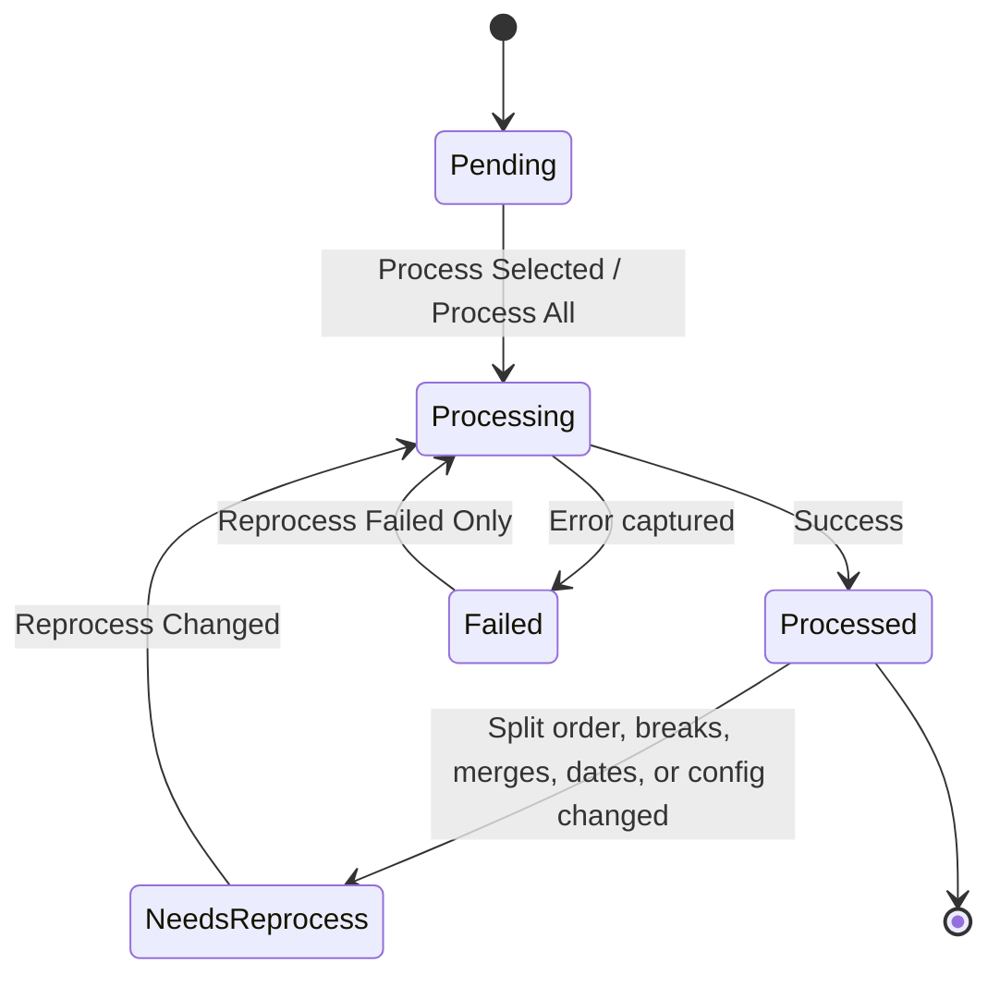
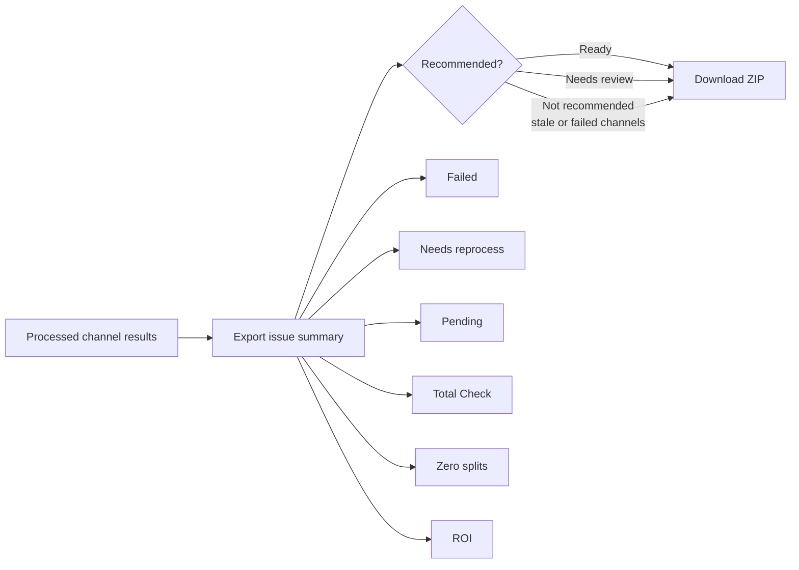
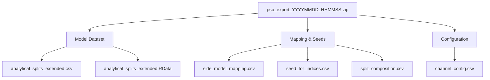
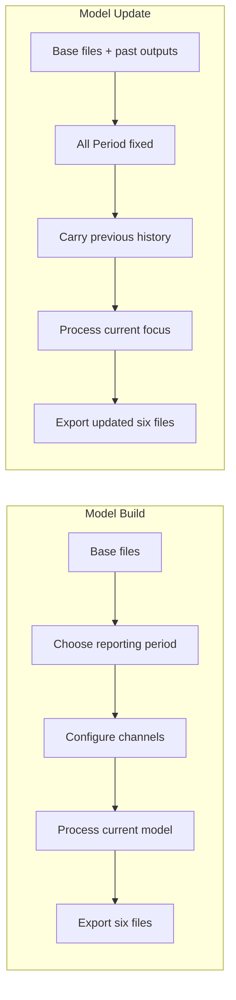

<div align="center">

# Split Generator for PSO

**A Shiny workflow for building, validating, processing, and exporting PSO media split datasets.**

Advanced Analytics Colombia / WPP Media

<br>


</div>

---

## Overview

Split Generator for PSO helps analysts transform RAE media data into model-ready split variables for PSO Marketing Mix Modeling. The app keeps the workflow auditable from upload to export: file validation, VOF/MFF channel detection, split order configuration, dimension breaks, saved merges, processing diagnostics, stale result detection, and final ZIP packaging.

It supports two operating modes:

| Mode | Use it when | Main output behavior |
| --- | --- | --- |
| **Model Build** | Building a new PSO model split structure from scratch. | Creates focus and non-focus split columns from the selected reporting period. |
| **Model Update** | Extending a previous model with a new focus period. | Carries past split history forward and appends the current RAE Datafile as the new focus period. |

---

## Workflow At A Glance



| Tab | Primary responsibility | Analyst decisions |
| --- | --- | --- |
| **Setup** | Upload files, validate data alignment, build the media variable index. | Build vs Update mode, reporting period, file replacement/removal. |
| **Channels** | Decide which channels are active and how each channel splits. | Add/remove channels, import config, split order, dimension breaks. |
| **Process** | Execute processing and inspect channel outputs. | Process selected/all, merge splits, reprocess failed or changed channels. |
| **Export** | Package the final deliverables. | Review warnings and download the standard ZIP package. |

> [!NOTE]
> Tabs are available during exploratory setup. Missing files and incomplete states are surfaced as inline warnings or blockers inside the relevant tab instead of hiding the rest of the workflow.

---

## Data Flow



---

## Required Inputs

### Base Files

| File | Accepted formats | Required for | Notes |
| --- | --- | --- | --- |
| **RAE Datafile** | `.csv`, `.zip` | Activity and spend source rows. | Formerly called Main Data File. |
| **Analytical Dataset** | `.RData` | Existing analytical model variables and periods. | Used for validation, total checks, and output extension. |
| **VOF Metadata** | `.csv` | Preferred channel auto-configuration. | Provides model variable, analytical variable, dates, geography, effect, and channel metadata. |
| **ModelDetails** | `.csv` | Business filter for model variables. | Rows with `NONE`, including `6. NONE (Low)`, are excluded from import/manage channel lists. |
| **ROIs by Channel** | `.csv`, `.xlsx` | ROI coverage and channel labels. | Optional for exploration, strongly recommended before final export. |

### Model Update Files

| File | Accepted formats | Purpose |
| --- | --- | --- |
| **Past Analytical Splits** | `.csv`, `.RData` | Previous `analytical_splits_extended` output. |
| **Past Side Model Mapping** | `.csv` | Previous `side_model_mapping` output. |
| **MainVars Mapping** | `.xlsx`, `.xls` | Detects and carries update IDs. |

> [!TIP]
> In Model Update mode, Reporting Period is fixed to **All Period** because the uploaded RAE Datafile is treated as the current focus period. When returning to Model Build, the previous build-period setting is restored.

---

## Setup

Setup is the intake and validation layer.

### What Setup Handles

| Area | Behavior |
| --- | --- |
| **Batch upload** | The Base Files input accepts multiple files and routes them into the correct file cards when possible. |
| **File cards** | Each card shows loaded state, filename, metadata, source (`manual` or `batch`), timestamp, and remove/reload controls. |
| **Validation** | Compares Analytical vs RAE Datafile for scope, date range, geography/product coverage, and data quality. |
| **Media index** | Builds available channel definitions from RAE Datafile, Analytical, VOF Metadata, ModelDetails, and ROIs when available. |
| **Model Update prep** | Reads previous split outputs and mapping files to prepare update-mode history. |

### Validation States



| Status | Meaning | Analyst action |
| --- | --- | --- |
| `Action needed` | A blocker or missing critical input exists. | Fix upload, structure, or missing required columns. |
| `Warnings found` | Processing can continue, but assumptions should be reviewed. | Read the validation table before proceeding. |
| `Validation OK` | Main alignment checks are clean. | Continue to Channels and Process. |

---

## VOF, MFF, And Channel Detection

The app prefers VOF metadata. MFF / keyword fallback is used only when a variable is not already covered by VOF.



### Detection Rules

- VOF rows are matched against ModelDetails using normalized model-variable names.
- VOF rows can also match when `AnalyticalVariableName` exists in the Analytical Dataset.
- Fallback channels are not created for variables already claimed by VOF.
- The channel manager remains filtered by ModelDetails and excludes rows containing `NONE`.
- Date parsing detects the dominant slash-date format in the VOF vector before parsing ambiguous dates.
- Time-break labels are assigned by unique date ranges, not by duplicate VOF rows.

---

## Channels

Channels is the configuration workspace. It decides which channels are active and how each channel will split.

### Main Controls

| Control | Purpose |
| --- | --- |
| **Save Config** | Download the current channel configuration as CSV. |
| **Load Config** | Preview a configuration import before applying it. |
| **Import / Manage Channels** | Add/remove available channels while respecting ModelDetails scope. |
| **Save All Split Orders** | Save all current split order settings. |
| **Search channels** | Filter active channel cards. |

### Channel Card Signals

| Badge | Meaning |
| --- | --- |
| `VOF` | Channel was auto-configured from VOF Metadata. |
| `MFF` | Channel was built from RAE Datafile / fallback logic. |
| `KW` | Keyword fallback detected a usable activity/spend pattern. |
| `Configured` | Split order and model variable are available. |
| `No ROI` | No matching ROI was found yet. |
| `Date limited` | Channel has min/max period restrictions. |
| `Needs reprocess` | A processed channel changed and should be run again. |

### Config Import



Config import is intentionally an overwrite operation for channels present in the config. The imported config becomes the source of truth for split order, dates, breaks, and merges. Channels not present in the CSV are not deleted.

Supported config formats:

- Current format: `Name` + `Splits`.
- Legacy format using `BreakInfo`.

### Dimension Breaks

Dimension Breaks split one text dimension into derived dimensions. For example, a campaign string can be broken into multiple named parts such as `Campaign_A`, `Campaign_B`, and `Campaign_C`. Breaks are applied consistently to both activity and spend.

---

## Process

The Process tab runs the channel engine and provides operational diagnostics.



### Actions

| Action | Behavior |
| --- | --- |
| **Process Selected** | Runs only the selected channel. |
| **Process All** | Runs channels that are pending or stale. |
| **Reprocess Failed Only** | Retries only failed channels. |
| **Reprocess Changed** | Runs channels marked `Needs reprocess`. |
| **Download Config** | Exports the current channel config from the process view. |

### Diagnostics

| Diagnostic | Purpose |
| --- | --- |
| **Activity** | Shows generated activity splits and supports merge selection. |
| **Spend** | Shows spend diagnostics. If spend is missing or unmatched, the UI shows an inline message instead of going blank. |
| **Total Check** | Compares processed output against Analytical expectations. |
| **Merge Plan** | Documents active merge operations and can be downloaded. |
| **Warnings / Errors** | Captures channel-level failures so the user does not depend only on notifications. |

---

## Export

Export produces the standard PSO ZIP package. Preflight QA has been removed from the UI; issues are presented only when there is something meaningful to review.



### Export Issues

| Issue | What it means | Recommended action |
| --- | --- | --- |
| **Failed** | One or more channels errored during processing. | Use `Reprocess Failed Only`. |
| **Needs reprocess** | Results are stale after channel configuration changed. | Use `Reprocess Changed`. |
| **Pending** | Active channels have not been processed. | Use `Process All` or `Process Selected`. |
| **Total Check** | Processed totals differ from Analytical expectations. | Review the channel in Process. |
| **Zero splits** | A processed channel produced no split columns. | Check filters, dates, and split order. |
| **ROI** | ROI file is missing or coverage is incomplete. | Upload or correct ROIs by Channel. |

The app does not hard-block ZIP creation for warnings, but it clearly marks when export is not recommended.

## Export Package



| File | Description |
| --- | --- |
| `analytical_splits_extended.csv` | Analytical dataset plus appended split columns. |
| `analytical_splits_extended.RData` | Same dataset as an RData object for the next update cycle. |
| `side_model_mapping.csv` | Split-to-model mapping with PSO weight structure. |
| `seed_for_indices.csv` | Activity, spend, ROI, channel, and split-order seed data. |
| `split_composition.csv` | Split lineage and merge composition. |
| `channel_config.csv` | Reusable channel configuration, including split order, breaks, merges, and dates. |

No `qa_report.csv` is generated.

---

## Model Build vs Model Update



### Model Build

Use Model Build when creating a new PSO model split structure from scratch.

1. Upload base files.
2. Select Reporting Period: Last 52w, Last 13w, All Period, or Custom.
3. Review File Validation and Media Variable Index.
4. Import/manage channels.
5. Configure split order, breaks, and merges.
6. Process channels.
7. Export the six-file ZIP.

### Model Update

Use Model Update when extending a previous model with a new focus period.

1. Switch Setup to Model Update.
2. Upload base files.
3. Upload past split files and mapping files.
4. Confirm Past Update ID, Past Label, and Current Update ID.
5. Review update processing status.
6. Configure and process the current focus period.
7. Export the updated six-file ZIP.

---

## Repository Structure

```text
Split-Generator-for-PSO/
|-- global.R                  # Libraries, constants, theme, module sourcing
|-- ui.R                      # Main app shell and navigation
|-- server.R                  # Module wiring
|-- manifest.json             # Posit Connect / Shiny Connect deployment manifest
|-- Description               # Package-style dependency metadata
|-- renv.lock                 # Recorded R package environment
|-- R/
|   |-- mod_setup.R           # Setup tab: uploads, validation, update-mode prep
|   |-- mod_channels.R        # Channels tab: add/remove/config/breaks/import
|   |-- mod_process.R         # Process tab: processing, diagnostics, merges
|   |-- mod_export.R          # Export tab: package preview and ZIP writer
|   |-- utils/
|       |-- functions.R       # Media index, date parsing, config helpers
|       |-- processing.R      # Core processing helpers and merge application
|-- www/
|   |-- styles.css            # WPP visual styling
|   |-- custom.js             # Browser helpers for Shiny inputs/DataTables
|   |-- img/logo.png          # WPP logo
```

`Data Testing/`, local `.RData`, CSV, XLSX, and deployment account files are intentionally excluded from deployment and should not be committed.

---

## Installation

Recommended local setup:

```r
renv::restore()
shiny::runApp(".")
```

If `renv::restore()` cannot complete, install the required packages loaded in `global.R`:

```r
install.packages(c(
  "shiny", "bslib", "DT", "dplyr", "tidyr", "stringr",
  "readr", "purrr", "readxl", "janitor", "sortable",
  "data.table", "arrow", "zip", "here", "future", "future.apply"
))
```

---

## Deployment To Posit Connect / Shiny Connect

This repository includes a generated `manifest.json` for source-based deployment.

| Field | Value |
| --- | --- |
| Repository | `MiguelPalmaWpp/Split-Generator-for-PSO` |
| Branch | The branch you want to publish, usually `main`. |
| Primary file | `ui.R` for the current Shiny `ui.R` + `server.R` structure. |
| Auto publish on push | Enable for stable branches; disable while testing heavy changes. |

The manifest is generated with explicit app files so local testing data is not deployed:

```r
files <- c(
  "global.R", "ui.R", "server.R", "Description", "README.md", "LICENSE",
  list.files("R", recursive = TRUE, full.names = TRUE),
  list.files("www", recursive = TRUE, full.names = TRUE)
)

rsconnect::writeManifest(
  appDir = getwd(),
  appFiles = gsub("\\\\", "/", files),
  dependencyResolution = "library"
)
```

If Connect does not accept `ui.R` as the primary file, add an `app.R` wrapper:

```r
source("global.R")
source("ui.R")
source("server.R")
shinyApp(ui, server)
```

Then set Primary file to `app.R`.

---

## Development Notes

Use these checks before pushing larger changes:

```powershell
git diff --check
```

```powershell
& 'C:\Program Files\R\R-4.3.1\bin\x64\Rscript.exe' -e "files <- c('global.R','ui.R','server.R', list.files('R', pattern='\\.R$', recursive=TRUE, full.names=TRUE)); for (f in files) { invisible(parse(f)); cat('OK', f, '\n') }"
```

Regression areas to test after changes:

| Area | Manual checks |
| --- | --- |
| Setup | Batch upload, remove/reload cards, missing ROIs, validation table. |
| Channels | VOF import, MFF fallback, config preview/apply, overwrite existing channels, remove/add state. |
| Process | Spend tab, Total Check, failed channels, stale channels, reprocess changed. |
| Export | Warnings, stale/failed/pending states, ZIP contains exactly six files. |

---

## Troubleshooting

| Symptom | Likely cause | What to check |
| --- | --- | --- |
| VOF variable appears as MFF | VOF row is not in ModelDetails scope or cannot match Analytical. | Confirm `Type` is not `NONE`, and check `MainModelVariableName` / `AnalyticalVariableName`. |
| Date ranges look wrong | Source file mixes date formats. | Normalize VOF `MinPeriod` and `MaxPeriod`; avoid mixing `MM/DD/YYYY` and `DD/MM/YYYY`. |
| Spend tab is empty | No matching spend rows or keyword mismatch. | Review `spend_keyword` and RAE Datafile variable names. |
| Export reports stale channels | Channel config changed after processing. | Use `Reprocess Changed`. |
| Export reports pending channels | Active channels have not been processed. | Use `Process All` or `Process Selected`. |
| Export reports ROI issues | ROIs file missing or incomplete. | Upload or correct ROIs by Channel before final export. |

---

<div align="center">

**Advanced Analytics Colombia / WPP Media**

Repository owner: `MiguelPalmaWpp`

</div>
